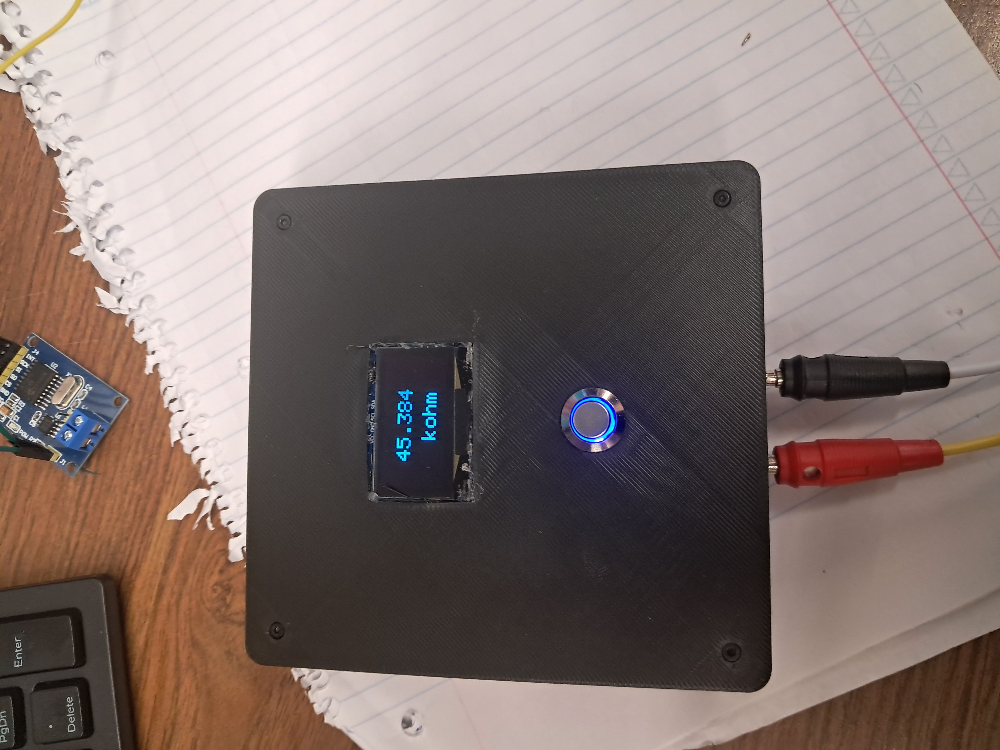

## Impedance Meter

ECG electrodes are a crucial component for accurate ECG measurement. In the
development of wearable devices, key factors include user comfort and the reusability of the
electrodes. To ensure signal fidelity, both the magnitude and stability of the electrode-skin
impedance must be considered. Measuring only DC resistance fails to accurately represent the
behavior of biological tissues and electrodes in an AC context. Therefore, developing a
dedicated impedance measurement device was a crucial part of this project. This device was
based on the Arduino Nano 33 IoT and its built-in Digital-to-Analog Converter (DAC) and
Analog-to-Digital Converter (ADC). By using the concept of voltage division, the Arduino
was capable of providing accurate impedance measurements with an error of 6% over a range
of 300 Ω to 0.7 MΩ.

## Impedance Meter Schematic

  

## Device Image

Here is a picture of the device:

  

---
# [Download the full project report (PDF)](Impedance-measurement-CAD-Schematics-testing/Pics_final_device.pdf)
